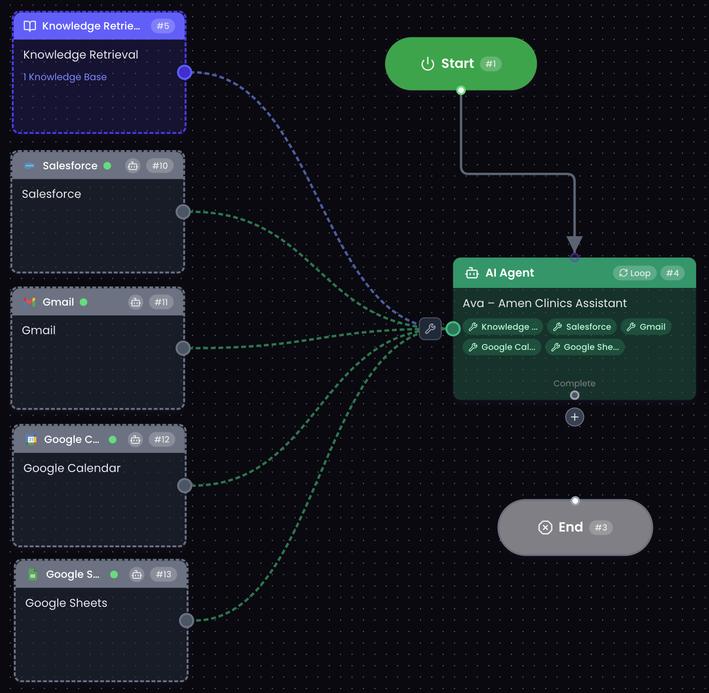
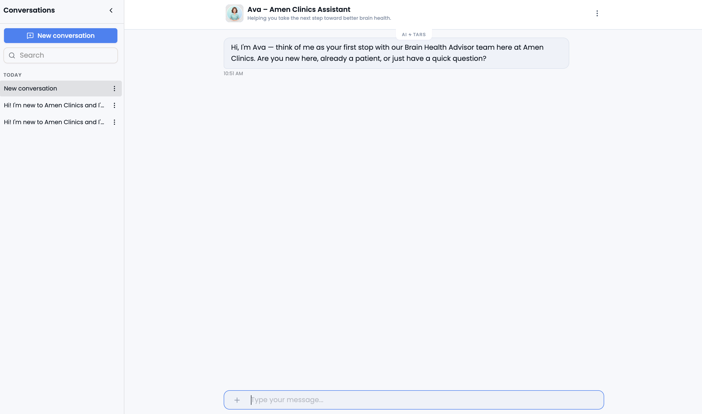
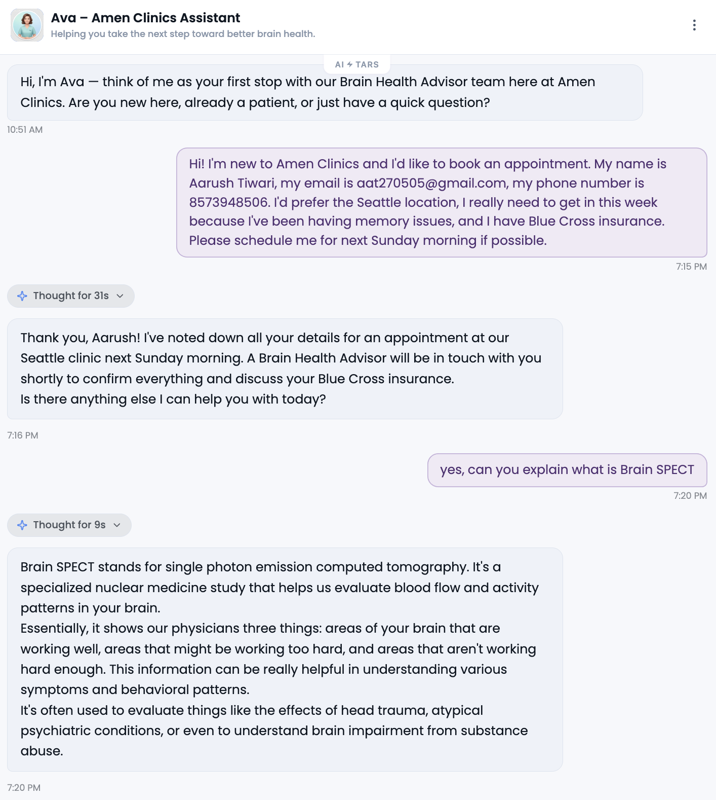
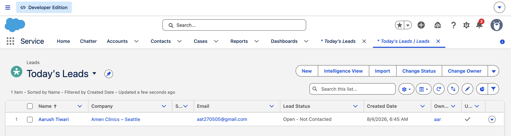
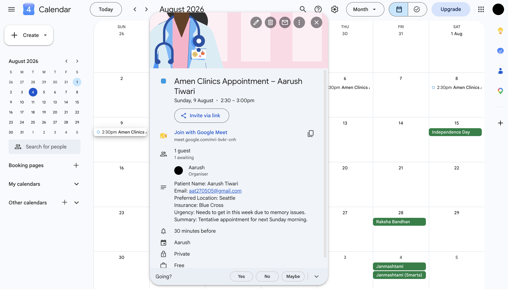
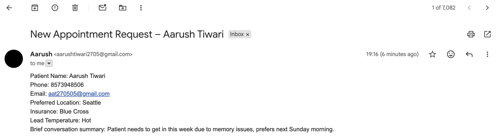

# Ava • Intelligent Healthcare Workflow Assistant

<p align="center">
  
</p>

<h3 align="center">
An AI-powered healthcare assistant that combines Retrieval-Augmented Generation (RAG), conversational AI, CRM automation, and Google Workspace integrations to streamline patient engagement and appointment management.
</h3>

<p align="center">


</p>

---

# Table of Contents

- Overview
- Motivation
- Features
- Architecture
- Workflow
- Screenshots
- Technology Stack
- Prompt Engineering
- Integrations
- Repository Structure
- Documentation
- Challenges
- Future Improvements
- Author
- License

---

# Overview

Modern conversational AI systems should do much more than answer questions.

Ava was built around the idea that an AI assistant should become an operational member of an organization rather than simply functioning as a chatbot.

Instead of responding with generated text alone, Ava combines knowledge retrieval, conversation memory, prompt engineering, CRM automation, and productivity integrations into a single workflow capable of supporting patients from their first interaction through appointment creation.

The assistant was developed around **Amen Clinics**, a healthcare organization specializing in brain health and Brain SPECT imaging.

Users can ask questions regarding:

- Brain SPECT imaging
- Services offered
- Clinic locations
- Insurance information
- Appointment process
- Frequently asked questions

Once appointment intent is detected, the assistant transitions naturally into an administrative workflow that automates business processes traditionally performed manually.

The project demonstrates how conversational AI can become an orchestration layer capable of coordinating multiple enterprise systems while maintaining a natural conversational experience.

---

# Motivation

Most AI chatbots stop after generating a response.

Real organizations require significantly more.

A patient asking to schedule an appointment should not force staff to manually copy information into a CRM, send confirmation emails, create calendar entries, and maintain administrative records.

Those repetitive tasks can be automated.

This project explores how Large Language Models, Retrieval-Augmented Generation, prompt engineering, and workflow automation can be combined into a practical healthcare solution capable of supporting both patients and administrative staff.

The primary goals were:

- Reduce repetitive administrative work
- Improve patient experience
- Minimize hallucinations
- Maintain healthcare safety
- Demonstrate enterprise AI integration

---

# Key Features

## Intelligent Conversation

- Natural conversational experience
- Conversation memory
- Multi-turn dialogue
- Context retention

---

## Retrieval-Augmented Generation

Rather than relying solely on language model knowledge, Ava retrieves information from a curated Knowledge Base before generating factual responses.

This significantly improves reliability while reducing hallucination.

Knowledge includes:

- Clinic services
- Brain SPECT information
- Insurance
- Pricing
- Locations
- Appointment process

---

## Patient Classification

The assistant automatically identifies whether the visitor is:

- New Patient
- Existing Patient
- General Inquiry

Each follows a different conversational strategy while remaining within the same AI Agent.

---

## Appointment Booking

Instead of presenting a rigid form, patient information is collected naturally throughout the conversation.

Collected information includes:

- Name
- Phone Number
- Email
- Preferred Clinic
- Appointment Timing
- Insurance
- General Reason for Visit

---

## CRM Automation

After collecting sufficient information, Ava automatically creates:

- Salesforce Lead
- Salesforce Task

Lead qualification is performed internally using:

- Hot
- Warm
- Cold

classification.

---

## Google Workspace Automation

Successful bookings trigger:

- Gmail notification
- Google Calendar event
- Google Sheets booking log

eliminating manual administrative work.

---

## Healthcare Safety

Safety is treated as a first-class architectural concern.

Implemented safeguards include:

- Crisis detection
- Emergency response override
- No diagnosis generation
- No medication recommendations
- No fabricated patient information
- Grounded knowledge retrieval

---

## Modular Architecture

The project separates:

- Conversation
- Retrieval
- Prompt Engineering
- CRM
- Scheduling
- Notifications
- Logging

making the assistant significantly easier to extend in future iterations.

---

# System Architecture

The architecture follows an orchestration-based design where the AI Agent acts as the central coordinator between the user, the knowledge base, and multiple external business systems.

Unlike conventional chatbots that only generate responses, Ava is capable of retrieving verified information, maintaining conversational context, executing business workflows, and coordinating enterprise integrations within a single conversation.

<p align="center">

</p>

The workflow can be summarized as follows:

```
                         User
                           │
                           ▼
                Ava Healthcare Assistant
                           │
       ┌───────────────────┼───────────────────┐
       │                   │                   │
       ▼                   ▼                   ▼
 Knowledge Base      Conversation        Prompt Engine
  (RAG)                 Memory
       │
       ▼
 Intent Detection & Decision Making
       │
       ▼
────────────────────────────────────────────────────

 Salesforce CRM

 Gmail Notifications

 Google Calendar

 Google Sheets

────────────────────────────────────────────────────
```

The AI Agent acts as the orchestration layer responsible for:

* Understanding user intent.
* Retrieving verified knowledge.
* Applying prompt constraints.
* Maintaining conversational context.
* Executing downstream business workflows.
* Protecting healthcare safety.

---

# End-to-End Workflow

Every conversation follows a structured lifecycle.

## 1. Conversation Begins

The interaction starts with Ava introducing itself as the digital front door for Amen Clinics.

Rather than immediately asking for personal information, the assistant first establishes the user's context.

Typical categories include:

* New Patient
* Existing Patient
* General Inquiry

This allows the assistant to adapt its behavior while maintaining a single conversational experience.

---

## 2. Understanding User Intent

Once the first user message is received, the assistant determines the purpose of the conversation.

Examples include:

**Information seeking**

> "What is Brain SPECT?"

**Appointment booking**

> "I'd like to schedule an evaluation."

**Existing patient support**

> "I'd like to reschedule my appointment."

**Account-specific requests**

> "Can I see my previous reports?"

Each category follows different operational logic while sharing the same conversational interface.

---

## 3. Retrieval-Augmented Generation

Whenever factual information is required, Ava first consults its Knowledge Base.

Instead of relying solely on the language model, the assistant retrieves verified information regarding:

* Brain SPECT imaging
* Clinic services
* Conditions treated
* Insurance
* Locations
* Appointment process
* Frequently asked questions

Grounding responses in retrieved documentation significantly reduces hallucination while improving factual consistency.

---

## 4. Natural Information Collection

If appointment intent is detected, Ava transitions into booking mode.

Unlike traditional chatbots that present a lengthy form, information is gathered conversationally over multiple messages.

Information collected includes:

* Patient Name
* Phone Number
* Email Address
* Preferred Clinic
* Appointment Timing
* Insurance Provider
* General Reason for Visit

Because conversation memory is enabled, previously collected information is never requested twice.

---

## 5. Internal Lead Qualification

Before any CRM interaction occurs, the assistant evaluates the overall booking intent.

Every booking is internally categorized as:

### 🔴 Hot

Strong booking intent together with urgency.

Examples include:

*"I need an appointment this week."*

*"I've been waiting for months."*

---

### 🟡 Warm

Clear booking intent without urgency.

---

### 🔵 Cold

Informational conversations that never become actionable.

This classification remains completely invisible to users while helping clinic staff prioritize follow-up.

---

## 6. Business Workflow Automation

Once sufficient information has been collected, the assistant transitions from conversation into automation.

The execution order is intentionally sequential.

```
Conversation

↓

Salesforce Lead

↓

Salesforce Task

↓

Gmail Notification

↓

Google Calendar Event

↓

Google Sheets Entry

↓

Confirmation
```

Each automation executes only after the previous operation succeeds, ensuring the workflow remains consistent.

---

# Feature Walkthrough

The following screenshots demonstrate the major capabilities implemented within the project.

---

## AI Conversation

The assistant answers questions using Retrieval-Augmented Generation while maintaining a natural conversational experience.

<p align="center">

</p>

Highlights:

* Friendly conversational interface.
* Healthcare-focused assistant.
* Conversation memory enabled.
* Knowledge-grounded responses.

---

## Knowledge Retrieval in Action

The assistant retrieves information from the Amen Clinics Knowledge Base before generating factual responses.

<p align="center">

</p>

Capabilities demonstrated:

* Knowledge retrieval.
* Context awareness.
* Appointment detection.
* Natural conversational flow.

---

## Salesforce CRM Integration

Appointment requests automatically create CRM records without requiring manual intervention.

<p align="center">

</p>

Automatically created:

* Lead
* Follow-up Task
* Lead Qualification
* Conversation Summary

---

## Google Calendar Integration

Once booking information becomes available, the assistant creates a tentative calendar event.

<p align="center">

</p>

Benefits include:

* Early scheduling visibility.
* Administrative convenience.
* Reduced manual coordination.

---

## Gmail Notifications

Clinic staff receive immediate email notifications after a successful appointment request.

<p align="center">

</p>

The generated email contains:

* Patient Name
* Contact Information
* Preferred Clinic
* Insurance Information
* Lead Temperature
* Conversation Summary

---

## Google Sheets Logging

Each completed booking is also appended to a Google Sheet for lightweight operational reporting.

The implementation has been completed within the workflow architecture.

The logging structure records:

* Booking Timestamp
* Patient Name
* Contact Information
* Preferred Location
* Insurance
* Lead Category
* Appointment Timing
* Conversation Summary

---

# Why This Architecture?

Several architectural decisions were made intentionally.

Retrieval-Augmented Generation was selected instead of relying entirely on the language model because healthcare applications demand grounded, verifiable information.

A single AI Agent was chosen over multiple specialized agents to simplify maintenance while preserving conversational flexibility through structured prompt engineering.

Salesforce serves as the operational source of truth for appointment requests, while Google Workspace integrations provide immediate visibility and lightweight administrative automation.

Together, these components transform Ava from a traditional chatbot into an AI-powered workflow assistant capable of supporting real organizational processes.

# Prompt Engineering

One of the primary goals of this project was to demonstrate that conversational AI behavior can be engineered systematically rather than relying on a single, monolithic prompt.

Instead of embedding all instructions into one large prompt, the assistant follows a structured prompting strategy composed of four independent layers.

```
Persona

↓

Instructions

↓

Constraints

↓

Response Format
```

Each layer serves a distinct responsibility.

### Persona

Defines **who** the assistant is.

Rather than presenting itself as a medical professional, Ava clearly identifies itself as the digital front door for Amen Clinics while remaining transparent that it is an AI assistant.

This establishes realistic expectations from the beginning of every conversation.

---

### Instructions

The Instructions section defines the operational behavior of the assistant.

Responsibilities include:

* Patient identification
* Knowledge retrieval
* Appointment booking
* CRM automation
* Tool execution
* Business workflow orchestration

Separating operational behavior from personality significantly improves maintainability and readability.

---

### Constraints

Healthcare assistants require stronger safeguards than conventional conversational agents.

The Constraints layer prevents the assistant from:

* Diagnosing medical conditions
* Suggesting medication changes
* Fabricating patient information
* Guessing insurance coverage
* Revealing internal lead qualification

This layer also contains the crisis override, ensuring emergency situations always take precedence over administrative workflows.

---

### Response Format

The Response Format focuses exclusively on communication style.

Responses are intentionally designed to remain:

* Conversational
* Short
* Human-like
* Easy to understand

Instead of presenting lengthy forms, information is collected naturally across multiple conversational turns.

---

# Safety Considerations

Healthcare AI systems require higher standards of reliability than general-purpose assistants.

Several safeguards were incorporated throughout the project.

### Grounded Responses

All factual information originates from the Knowledge Base using Retrieval-Augmented Generation.

If relevant information cannot be retrieved, the assistant explicitly communicates uncertainty rather than generating unsupported answers.

---

### Crisis Detection

Every incoming message is evaluated for emergency language.

If immediate danger or crisis-related content is detected:

* Appointment booking stops immediately.
* External workflows are not executed.
* The assistant delivers a predefined emergency response.

This behavior always has higher priority than normal conversation.

---

### Medical Boundaries

The assistant intentionally avoids acting as a healthcare professional.

It never:

* Diagnoses conditions.
* Interprets symptoms.
* Recommends treatments.
* Modifies medications.
* Accesses protected medical records.

Whenever account-specific information is requested, users are redirected to qualified clinic staff.

---

# Technical Challenges

Building the assistant involved several implementation challenges.

### Understanding the Platform

The first challenge involved understanding how Tars organizes AI Agents, Knowledge Bases, conversation memory, integrations, and workflow execution.

Considerable time was spent experimenting with the platform before implementing the final architecture.

---

### Platform Differences

During development, the available version of Tars differed from some tutorials and documentation.

Certain routing components described in earlier resources were unavailable within the current builder.

Instead of treating this as a blocker, the workflow was redesigned around a single orchestrator AI Agent using structured prompt engineering.

The resulting implementation preserved the intended behavior while reducing architectural complexity.

---

### Healthcare Reliability

Healthcare information cannot rely entirely on language model generation.

This motivated the decision to combine Retrieval-Augmented Generation with explicit operational constraints to reduce hallucination and improve response reliability.

---

### Workflow Automation

Integrating multiple external services required careful sequencing.

Business workflows were designed so that external tools execute only after sufficient patient information has been collected, reducing unnecessary automation and improving consistency across systems.

---

# Repository Structure

```
ava-healthcare-assistant/

├── README.md
├── LICENSE
│
├── assets/
│   └── avatar.png
│
├── screenshots/
│   ├── 01-system-architecture.png
│   ├── 02-chat-interface.png
│   ├── 03-conversation.png
│   ├── 04-salesforce-lead.png
│   ├── 05-gmail-notification.png
│   └── 06-google-calendar.png
│
└── docs/
    ├── architecture.md
    ├── workflow.md
    ├── integrations.md
    └── prompt-engineering.md
```

---

# Documentation

The repository includes detailed technical documentation describing the system beyond what is presented in this README.

| Document | Description |
|----------|-------------|
| **architecture.md** | Explains the overall system architecture, design philosophy, and component interactions. |
| **workflow.md** | Describes the complete conversational lifecycle from user interaction to workflow automation. |
| **integrations.md** | Covers Salesforce, Gmail, Google Calendar, Google Sheets, Retrieval-Augmented Generation, and conversation memory. |
| **prompt-engineering.md** | Documents the structured prompt architecture, design decisions, safety constraints, and prompting strategy. |

---

# Future Improvements

Although the assistant successfully automates several operational workflows, there are multiple opportunities for future enhancement.

### Healthcare Systems

* Electronic Health Record integration
* Secure patient authentication
* Insurance eligibility verification
* Live appointment scheduling
* Prescription refill workflow

---

### AI Improvements

* Confidence-aware retrieval
* Multi-language support
* Voice interaction
* Personalized follow-up conversations
* Dynamic response generation

---

### Operational Improvements

* SMS notifications
* Analytics dashboard
* Appointment reminder automation
* Administrator dashboard
* Reporting and usage metrics

---

# Lessons Learned

This project reinforced several important engineering concepts.

* AI assistants become significantly more valuable when connected to business systems rather than operating in isolation.

* Retrieval-Augmented Generation provides a practical approach for reducing hallucination in domain-specific applications.

* Prompt engineering is most maintainable when responsibilities are clearly separated instead of combining every instruction into a single prompt.

* Conversation memory greatly improves user experience by allowing interactions to feel natural rather than repetitive.

* Healthcare applications require explicit safety boundaries that prioritize user well-being over conversational flexibility.


---

# Author

## Aarush Tiwari

Computer Science Engineering (Artificial Intelligence)

Bennett University

### Connect

**LinkedIn**

https://www.linkedin.com/in/aarush-tiwari-57788428b/


